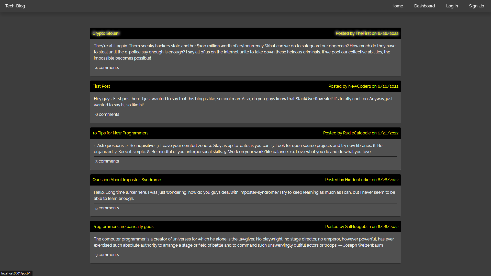
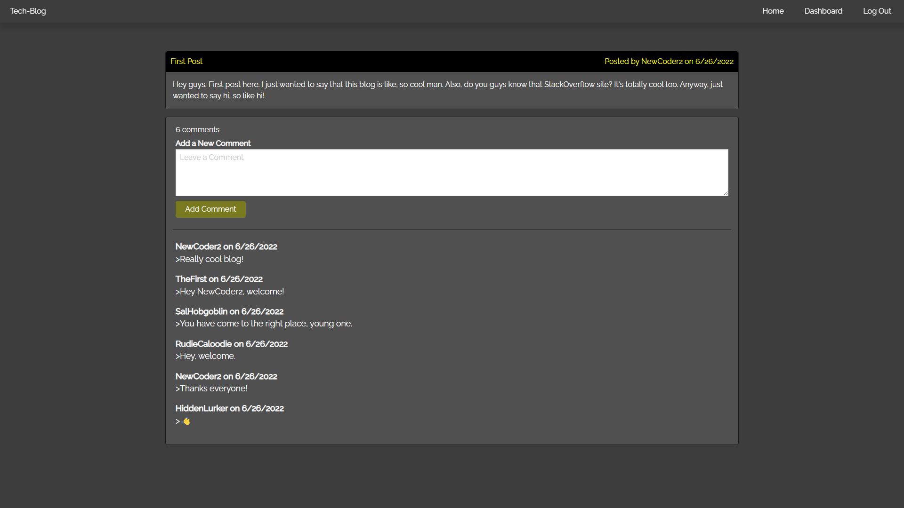
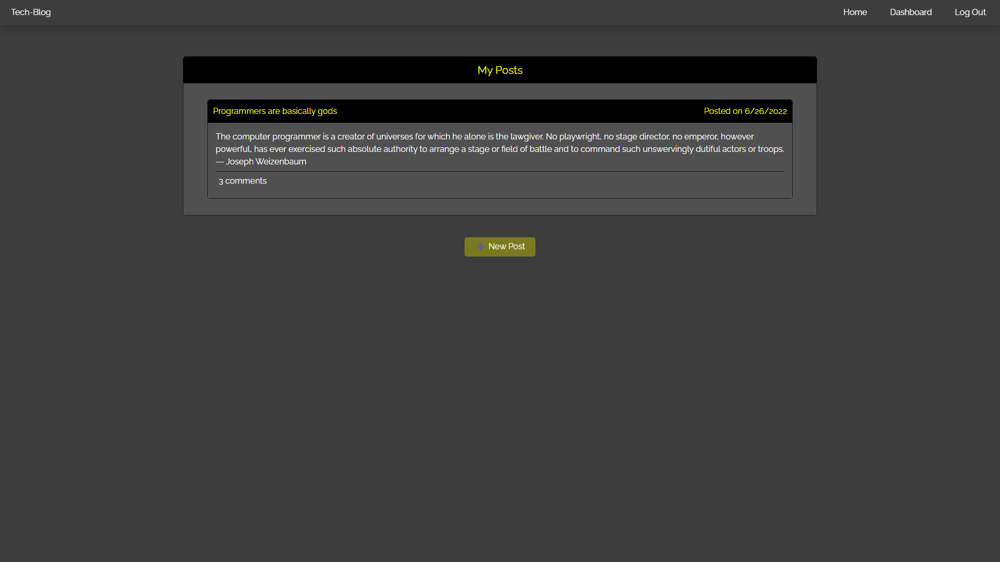
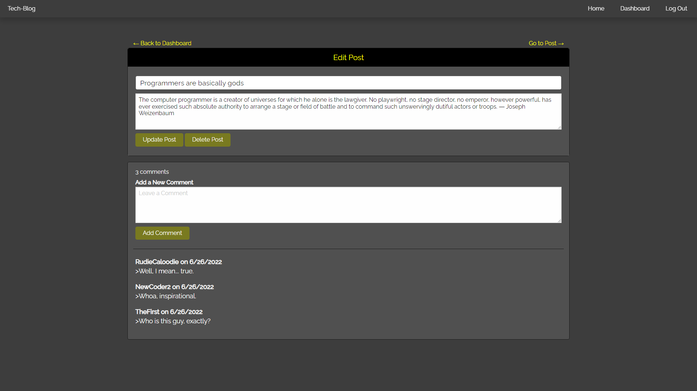

# Tech Blog

 

## Description

- My motivation behind this project was to implement all of the things I've learned about MVC to develop a full-stack application that mimics a simple blog website. 
- I built this project to understand the MVC development process, all of the pieces involved, and how they relate to each other.
- This project aimed to create a simple website that allows users to interact with one another through blog-posts. It allows users to create accounts, or log in to existing accounts, and access a dashboard to create, edit, and delete posts. It also allows users to create comments on posts when they are logged in.
- Through this project, I learned a lot about MVC. I also learned how to develop a full-stack application. Specifically, I learned about the various pieces of the MVC puzzle and how they fit together. I learned about the development process of a full-stack application. I initially was confused about what I should have been working on first, but this project definitely helped a lot in organizing the order in which I worked on pieces of the application. I also learned a lot about handlebars, how powerful it is, how the different handlebars documents fit together, and the logic associated with it. Finally, this project helped me to further develop some of the skills we've been learning throughout the past few weeks such as routing, express, and SQL, as well as things that we haven't been touching for some time, such as the front-end, CSS, HTML, and JS.

## Table of Contents

1. [Installation](#installation)
2. [Usage](#usage)
3. [Demonstration](#demonstration)
4. [License](#license)
5. [How to Contribute](#how-to-contribute)
6. [Questions?](#questions)

## Installation

This application is deployed to Heroku, and you can access it [here](https://richard-zhang-note-taker.herokuapp.com/).

Alternatively, you can clone this repo. 

If performing a manual installation, you need [Node.js](https://nodejs.org/en/) and [MySQL](https://www.mysql.com/).

To install dependencies, open in [Visual Studio Code](https://code.visualstudio.com/), and in the terminal run: 

      npm install 

Alternatively, you can navigate to the application's installation location in [Git Bash](https://git-scm.com/downloads) (or similar command-line tool) and do the same.

Before running the app, create a file named `.env` in the main folder with the following lines in the `.env` file:

      DB_USER='<your mySQL username>'
      DB_PW='<your mySQL password>'
      DB_NAME='techBlog_db'

Replace the `DB_USER` and `DB_PW` fields with your credentials.

To create the database, in the terminal start MySQL by running:

      mysql -u <your MySQL username> -p

Then create the database by running:

      source ./db/schema.sql;

`Exit` MySQL, and in the terminal, seed the database by running:

      npm run seed

## Usage

This application is deployed to Heroku, and you can access it [here](https://richard-zhang-note-taker.herokuapp.com/).

Alternatively, once the application is installed and opened in Visual Studio Code, or navigated to using Git Bash (or similar command-line tool), run: 

      npm start 

The application is written to run on port 3001, but you can change the port number by altering it in the server.js file.

Once the server has been started, in your browser, navigate to http://localhost:3001

##  Demonstration

This application is deployed to Heroku, and you can access it [here](https://richard-zhang-note-taker.herokuapp.com/).

Some screenshots:

## License

This application is covered under the [MIT](https://opensource.org/licenses/MIT) license

----------------------------------------------------------------

  Copyright © 2022 Richard Zhang

  Permission is hereby granted, free of charge, to any person obtaining a copy of this software and associated documentation files (the "Software"), to deal in the Software without restriction, including without limitation the rights to use, copy, modify, merge, publish, distribute, sublicense, and/or sell copies of the Software, and to permit persons to whom the Software is furnished to do so, subject to the following conditions:
  
  The above copyright notice and this permission notice shall be included in all copies or substantial portions of the Software.
  
  THE SOFTWARE IS PROVIDED "AS IS", WITHOUT WARRANTY OF ANY KIND, EXPRESS OR IMPLIED, INCLUDING BUT NOT LIMITED TO THE WARRANTIES OF MERCHANTABILITY, FITNESS FOR A PARTICULAR PURPOSE AND NONINFRINGEMENT. IN NO EVENT SHALL THE AUTHORS OR COPYRIGHT HOLDERS BE LIABLE FOR ANY CLAIM, DAMAGES OR OTHER LIABILITY, WHETHER IN AN ACTION OF CONTRACT, TORT OR OTHERWISE, ARISING FROM, OUT OF OR IN CONNECTION WITH THE SOFTWARE OR THE USE OR OTHER DEALINGS IN THE SOFTWARE.

  ----------------------------------------------------------------

## How to Contribute

If you want to contribute to this project and make it better, your help is very welcome. This was a school project, so anything you want to do to it, go for it. You can also contact me directly through the links below.

## Questions?

Have any questions? Here is a list of my links:
- GitHub: [RichardZhang01](https://github.com/RichardZhang01)
- Email: richardzhiyuanzhang@gmail.com

